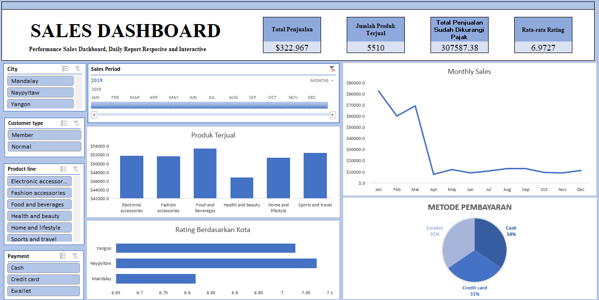

# Sales Dashboard Using Excel

## Overview
This project is an interactive Sales Dashboard built using **Microsoft Excel** to monitor sales performance across multiple dimensions such as city, customer type, product category, and payment method. The dashboard visualizes KPIs and trends in an interactive way using slicers and dynamic charts.

## Key Metrics
- Total Sales
- Total Quantity Sold
- Net Sales After Tax
- Average Rating

## Features & Insights
- Monthly sales trend analysis
- Best & low performing product categories
- Comparison of customer ratings by city
- Sales distribution by payment method (Cash / Credit Card / E-Wallet)
- Dynamic slicers for filtering by city, customer type, and product line

## Tools Used
- Microsoft Excel (Pivot Table, Pivot Chart, Slicers, Data Cleaning)

## Dashboard Preview

## Purpose
This dashboard helps business users understand monthly performance, customer behavior, and product demand, enabling better sales planning and decision-making.

